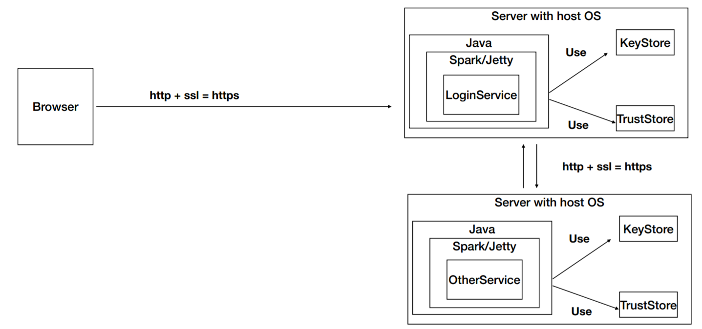

# SecuritySparkServices

# Credentials:

* username:
Eduardo
* password:
miclave

## Autor

* **J. Eduardo Arias Barrera** - [AriasAEnima](https://github.com/AriasAEnima)

# Documento:
## [(Click Aqui)](https://github.com/AriasAEnima/SecuritySparkServices/blob/master/imforme.pdf)

# First Machine
### https://ec2-3-86-147-99.compute-1.amazonaws.com:42001/

# Second Machine
### https://ec2-3-87-76-212.compute-1.amazonaws.com:42002/hello
### https://ec2-3-87-76-212.compute-1.amazonaws.com:42002/calcule?data=10+20+56

# Login Service

* Hay un servicio de login.
* Se verfica que la clave encriptada coincida con el usuario guardado
* Si es asi guarda atributos en la sesión y devuelve un formulario para intentar utilizar el servicio de la otra maquina.

* Si el login falla mostrara un json con error.

---

* En el servicio calcule verifica que exista un usuario autenticado en la sesión, si es asi , se loggea en la segunda maquina enviando la contraseña encriptada y finalmente pide el servicio al a segunda maquina.

---

* En la segunda maquina existe un login simple que responde si se pudo loggear y guardar atributos en la sesión.

* Solo corre el servicio de calcular si hay una sesión autenticada (tuvo que loggearse anteriormente la primera maquina)

## Licencia

This project is licensed under the MIT License  - see the [LICENSE](LICENSE) file for details
